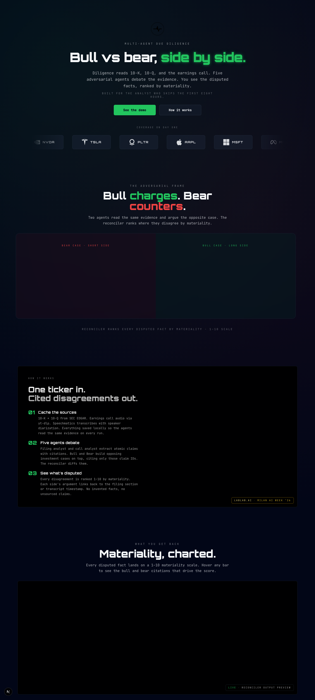

# Diligence

**Adversarial multi-agent due-diligence on public-company tickers.**

🔗 Live · https://diligence.duckdns.org
📺 Walk-through · _link added with hackathon submission_
🏆 Track · [lablab.ai Milan AI Week '26](https://lablab.ai/) — Vertex AI Gemini · Featherless · Speechmatics · Vultr
💸 Cost · ~$1.25 per fresh ticker ($0.21 Gemini + $1.04 Speechmatics enhanced); cached re-runs free

[](LICENSE)
[](frontend/)
[](https://cloud.google.com/vertex-ai)
[](https://www.langchain.com/langgraph)
[](https://www.vultr.com)



---

## What it does

Paste a public-company ticker. Diligence reads the **10-K, 10-Q, and the latest earnings call** (audio → diarized transcript), runs **five adversarial AI agents** that build the bull case and the bear case from the same evidence, then surfaces the **disputed facts** — ranked by materiality, citation-linked back to the source filing section or transcript timestamp.

> Built for the analyst who skips the first eight hours.

**Research-grade, not advisory.** No buy/sell/hold. Evidence and counter-evidence; the human decides.

---

## Why adversarial

Single-LLM summarisers are biased toward the loudest passage. Diligence forces two agents to argue opposite cases from the **same primary-source claim IDs**, then uses a third agent to score where they materially disagree. Every claim must cite a `claim_id` from the Filing or Call analyst's output; un-cited assertions are flagged automatically.

```
                ┌───────────────────────────┐
   10-K + 10-Q ─►│ Filing Analyst (Gemini)   ├── claim_ids F-001…
                └───────────────────────────┘
                ┌───────────────────────────┐
 Earnings call ─►│ Call Analyst   (Gemini)   ├── claim_ids C-001…
                └───────────────────────────┘
                           │
            ┌──────────────┼──────────────┐
            ▼                             ▼
   ┌────────────────┐            ┌────────────────┐
   │ Bull (Qwen3)   │   parallel │ Bear (Qwen3)   │
   └────────────────┘            └────────────────┘
            │                             │
            └──────────────┬──────────────┘
                           ▼
                ┌───────────────────────────┐
                │ Reconciler (Gemini)        │── DisputedFacts
                │  · diff bull vs bear       │   ranked 1–10 by
                │  · score materiality       │   materiality
                │  · flag uncited claims     │
                └───────────────────────────┘
```

Orchestrated by **LangGraph** (`StateGraph`, parallel Bull + Bear via `asyncio.gather`). Schemas are Pydantic, Vertex-enforced on the Gemini side; Featherless responses pass through a markdown-fence stripper before parsing.

---

## Stack

| Layer | Tech | Notes |
|-------|------|-------|
| Frontend | Next.js 16 · React 19 · Tailwind 4 · GSAP | App Router, Turbopack default. JavaScript (not TS) per author pref. |
| 3D scenes | Spline + @splinetool/react-spline | Two community scenes for hero accents (robot + interactive charts). |
| Agents | LangGraph 1.2 · Pydantic 2 · `google-genai` 2.3 · Featherless OpenAI-compat | Module-scope `Annotated[dict, reducer]` state for parallel writes. |
| Inference | Gemini 2.5 Pro (Vertex AI, `location="global"`) · Qwen3-32B (Featherless) | 1 M context, structured output via `response_schema=<PydanticModel>`. |
| Audio | yt-dlp · ffmpeg · Speechmatics (batch, diarized) | Word-level timestamps + speaker labels for click-to-jump UI. |
| Fundamentals | Financial Modeling Prep `/stable/` | Free tier; profile + ratios + 3 statements per ticker. |
| Filings | SEC EDGAR | 10-K + 10-Q stripped to plain text via `lxml`. |
| Host | Vultr High Frequency 8 vCPU · Ubuntu 24.04 · nginx · systemd | Frontend live; backend deploy planned post-agent build. |

---

## Status (2026-05-18)

| Layer | State |
|-------|-------|
| Ingestion pipeline (EDGAR + FMP + yt-dlp + Speechmatics) | ✅ Live; NVDA, TSLA, PLTR cached |
| Autonomous tier-scored audio candidate selector (T1 → T4) | ✅ Live; per-candidate audit in `manifest.sources.audio` |
| Pydantic schemas (`agents/schemas.py`) | ✅ Citation, Claim, FilingAnalysis, CallAnalysis, BullCase, BearCase, Reconciliation |
| Research questions (`docs/RESEARCH.md`) | ✅ All five resolved before agent code |
| Filing / Call / Bull / Bear / Reconciler agents | ✅ Shipped (LangGraph parallel-write reducer, per-node cache reuse) |
| FastAPI backend on Vultr (REST + SSE + ranged audio) | ✅ Live behind nginx + systemd |
| Frontend (landing + `/research/[ticker]` dashboard + `/methodology`) | ✅ Live at https://diligence.duckdns.org |
| Adversarial security review (CORS, X-Forwarded-For, SSE dedupe, atomic manifest writes, SSRF defence) | ✅ 154 findings, top-severity all fixed |
| Day-5 UI revamp — 7 surgical sessions | ✅ Merged + deployed |
| HTTPS via DuckDNS + Let's Encrypt | ✅ `https://diligence.duckdns.org`, auto-renew |
| Demo video | 🟡 Pending — only blocker for hackathon submission |

---

## Build journey — five stages

| # | Stage | Shipped | Receipt |
|---|-------|---------|---------|
| 1 | **The Bet** — primary-source cache | NVDA, TSLA, PLTR fully ingested. 364K-char 10-K, 170K-char 10-Q, ~60min earnings call, 10k+ word-level diarized transcript tokens per ticker. | `data/{T}/{10k,10q,fundamentals}.json` + `earnings_call.mp3` + `transcript.json` + `manifest.json` |
| 2 | **The Brains** — five adversarial agents | Filing Analyst (~30 atomic claims, char-range citations). Call Analyst (~27 claims + hedging examples, speaker + timestamp citations). Bull + Bear (Featherless Qwen3-32B) argue from shared claim pool. Reconciler ranks disputed facts 1–10 by materiality. | `analysis_{filing,call,bull,bear}.json` + `reconciliation.json`. PLTR: 3 disputed facts at materiality 10/8/8, 100% transcript diarization. |
| 3 | **The Cockpit** — dashboard | Next.js 16 + React 19 + Tailwind 4 + Recharts + wavesurfer.js v7. Three-column bull / disputed / bear; click chart bar → swap focus card; click claim chip → seek transcript audio or open SEC URL. | Live: https://diligence.duckdns.org/research/PLTR |
| 4 | **The Stress Test** — adversarial review + autonomous audio selector | 3 Claude sub-agents ran in parallel dismantle mode: 154 findings (4 CRITICAL, 7 HIGH). CORS lockdown, X-Forwarded-For LAST-hop parsing, SSE seq dedupe, atomic manifest writes, SSRF defence on audio fetches, yt-dlp `--dump-json`. Autonomous YouTube candidate selector: 5-dim scoring across ≤16 candidates, tier T1 issuer-named → T4 unverified, gated by `MIN_CANDIDATE_SCORE=50`. | `services/audio.py:find_best_audio_candidate` + `manifest.sources.audio.candidates_considered` |
| 5 | **The Reveal** — UI polish + HTTPS | 7 surgical UI sessions (per-claim ⚠/§ badges, `?fact=N` permalink, claim chip → seek/SEC URL, dashboard-wide citation interactivity, audit candidates table polish). HTTPS via DuckDNS + Let's Encrypt + certbot auto-renew on Vultr nginx. | https://diligence.duckdns.org (Let's Encrypt cert, expires 2026-08-15, auto-renew) |

---

## Cost per ticker

| Service | Component | Cost (fresh ingest) | Notes |
|---------|-----------|---------------------|-------|
| Vertex AI Gemini 2.5 Pro | Filing Analyst | ~$0.13 | 91K input + 5K output tokens |
| Vertex AI Gemini 2.5 Pro | Call Analyst | ~$0.05 | 25K + 3K |
| Vertex AI Gemini 2.5 Pro | Reconciler | ~$0.03 | 10K + 3K |
| Speechmatics | Diarized batch ASR (enhanced) | ~$1.04 | ~1 hr call × $1.04/hr tier-1 |
| Featherless | Bull + Bear (Qwen3-32B) | $0 marginal | Flat $25/mo plan |
| FMP / SEC EDGAR / yt-dlp | Fundamentals + filings + audio source | $0 | Free tier / public |
| **Total** | | **~$1.25** | |

Cached re-runs (`agents.run TICKER --reuse-cache`): **$0** — every node short-circuits on `data/{T}/analysis_*.json`.

---

## Auth — critical reproducibility note

`mirel-leonard-org` enforces `constraints/iam.disableServiceAccountKeyCreation`, so service-account JSON keys cannot be created. The laptop's Application Default Credentials file is also owned by a separate production project (RobotBoy) — overwriting it would re-route that project's billing.

**Solution:** mint a short-lived OAuth access token via `gcloud auth print-access-token` against the active gcloud configuration. Token lives in-process, is auto-refreshed before expiry, never touches disk. ADC file is untouched.

Implementation: [`vertex_client.py`](vertex_client.py). All Vertex AI work imports `get_client()` from that module.

### One-time setup

```bash
gcloud config configurations create hackathon
gcloud config configurations activate hackathon
gcloud auth login mirel_leonard@yahoo.com
gcloud config set project project-2be42b84-14e0-421a-b3a
gcloud services enable aiplatform.googleapis.com \
  --project=project-2be42b84-14e0-421a-b3a
```

### Every session

```bash
cd ~/diligence
source .venv/bin/activate
gcloud config configurations activate hackathon
```

---

## Run locally

```bash
git clone https://github.com/leonardtudor11/diligence.git
cd diligence

# Backend
python3.12 -m venv .venv
source .venv/bin/activate
pip install -r requirements.txt
cp .env.example .env  # fill in API keys

# Smoke test all five services (Day-1 probes)
python scripts/probe_vertex.py
python scripts/probe_speechmatics.py
python scripts/probe_featherless.py
python scripts/probe_fmp.py
python scripts/probe_edgar.py

# End-to-end ingestion (NVDA cached)
python -m services.ingest NVDA

# Frontend
cd frontend
npm ci
npm run dev    # → http://localhost:3000
```

---

## Service credentials

Copy `.env.example` → `.env` and fill in:

| Var | Source |
|-----|--------|
| `SPEECHMATICS_API_KEY` | speechmatics.com console (AIWEEK200 promo applied) |
| `FEATHERLESS_API_KEY` | featherless.ai dashboard |
| `FMP_API_KEY` | financialmodelingprep.com free tier |
| `SEC_USER_AGENT` | EDGAR ToS — set to your real email |
| `TWENTYFIRST_API_KEY` | _optional_ — only if using 21st.dev Magic MCP for UI generation |

---

## Repo layout

```
diligence/
├── vertex_client.py            # Auth helper — gcloud token, never touches ADC
├── .env.example                # Service credentials template
├── requirements.txt
├── scripts/                    # Day-1 probes + research_probes.py (Day-2 RQ verification)
├── services/                   # Production ingestion clients (Day 1 evening +)
│   ├── ingest.py, edgar.py, fmp.py, audio.py, speech.py
├── agents/                     # Adversarial agents + LangGraph orchestrator (Day 2)
│   └── schemas.py              # Pydantic contracts every agent reads/writes
├── frontend/                   # Next.js 16 landing + dashboard (Day 3)
│   ├── app/components/         # Hero, BullBearSplit, SplineSceneDemo, Footer
│   ├── components/ui/          # Card, Spotlight, Spline scene wrapper
│   ├── lib/utils.js            # cn() helper
│   └── public/                 # Bull/bear silhouettes + ticker brand logos
└── docs/
    ├── CONTEXT.md              # Original project briefing
    ├── HANDOFF.md (../)        # Per-session handoff doc
    ├── AUDIT.md                # Day-1 adversarial review findings
    ├── RESEARCH.md             # Day-2 research-question answers
    └── screenshot-landing.png  # Hero screenshot for this README
```

---

## Architecture pins (locked in `docs/RESEARCH.md`)

- **Async Gemini surface**: `await client.aio.models.generate_content(...)` works — no thread wrapping needed.
- **Structured output**: `response_schema=<PydanticModel>` enforced by Vertex for deeply nested lists.
- **Featherless gotcha**: `response_format: {"type": "json_object"}` is accepted but Qwen3-32B wraps payload in ``` ```json``` fences. Strip before `json.loads`.
- **LangGraph parallel writes**: module-scope `TypedDict` with `Annotated[dict, _merge_agents]` (Python 3.14 strict forward-ref eval).
- **Prompt-injection defence**: wrap filing/transcript content in `<filing>` / `<transcript>` XML, system prompt treats tag contents as data not instructions, surface `injection_detected: bool` on every analyst output.

---

## Sponsor track alignment

| Track | What we use |
|-------|-------------|
| **Vultr** | High Frequency 8 vCPU/16 GB instance in Frankfurt, $200 credit covers ~2 months runtime |
| **Gemini** | `gemini-2.5-pro` for Filing / Call / Reconciler (heavy reasoning + structured output) |
| **Featherless** | Qwen3-32B for parallel Bull / Bear adversarial reasoning |
| **Speechmatics** | Batch transcription + speaker diarization on the earnings call MP3 |

---

## Security model — high level

- `.env` is gitignored; the example file ships only var names + free-tier acquisition instructions.
- Auth uses short-lived gcloud OAuth tokens — no SA keys, no ADC file mutation.
- `httpx` and `httpcore` loggers muted in every module that hits a query-string API to prevent secret leakage in tracebacks.
- All HTTP-response key access wrapped + raised as a domain-specific `DiligenceError` subclass (audit-fixed Day 1).
- Production VM: UFW restricts to 22 / 80 / 443, fail2ban on sshd, automatic unattended security updates.

Full policy: [`SECURITY.md`](SECURITY.md). Day-1 audit report: [`docs/AUDIT.md`](docs/AUDIT.md).

---

## License

MIT — see [`LICENSE`](LICENSE).

Third-party visual assets retain their original licenses; see [`frontend/CREDITS.md`](frontend/CREDITS.md) (game-icons CC BY 3.0, Simple Icons CC0, Spline community CC0).

---

## Acknowledgments

- **lablab.ai / Milan AI Week '26** for the hackathon track + sponsor credits.
- **Google Vertex AI**, **Featherless**, **Speechmatics**, **Vultr** for the model + audio + compute credits.
- **Lorc** for the bull and bear silhouettes ([game-icons.net](https://game-icons.net), CC BY 3.0).
- **21st.dev** for the Spline-component pattern that ships our 3D hero accents.

🤖 Built with [Claude Code](https://claude.com/claude-code) (Anthropic), pair-programming in the loop.
